# Performance Benchmarks and Optimization Guide

This document provides performance benchmarks and optimization guidelines for the NumCircBuf library.

## Table of Contents

- [Performance Overview](#performance-overview)
- [Performance Characteristics](#performance-characteristics)
- [Core Benchmarking Methods](#core-benchmarking-methods)
- [Benchmarking Systems](#benchmarking-systems)
- [Raw Benchmarks](#raw-benchmarks)
- [Relative Benchmarks](#relative-benchmarks)
- [Optimization Guide](#optimization-guide)
- [Conclusion](#conclusion)
- [Running Benchmarks](#running-benchmarks)
- [Additional Resources](#additional-resources)

## Performance Overview

NumCircBuf provides contiguous, pre-allocated circular buffers designed for high-throughput ingestion and O(1) windowed analytics.

- **O(1) Analytics:** Implemented in specialized variants (RunningMeanBuffer, RunningMeanSqBuffer), separating computational cost from buffer depth.
- **Jitter & Fragmentation Mitigation:** Pre-allocated contiguous memory blocks eliminate allocation jitter and heap fragmentation during high-frequency ingestion.
- **Low-Level Execution:** Uses Cython/C with raw pointer arithmetic to bypass Python's object-model overhead and bounds-checking in hot paths.
- **Hardware-Adaptive:** Architecture-specific throughput scaling through BLAS-backed kernels, NumPy SIMD dispatch, and libc memcpy routines.
- **Optimized Data Ingestion:** Bulk data movement via `.extend()`, maximizes single-threaded hardware bandwidth saturation.

**Target Workloads:** Real-time digital signal processing (DSP), high-frequency telemetry ingestion, audio loudness analysis (EBU R128), and low-latency scientific computing.

## Performance Characteristics

### Time Complexity

#### Common Operations (All Buffer Categories)

| Operation Category | Complexity               |
| ------------------ | ------------------------ |
| extend             | $O(n)$                   |
| append             | $O(1)$                   |
| `view()`           | $O(1)$ view, $O(n)$ copy |
| `clear()`          | $O(1)$                   |
| clear NaN or Infs  | $O(n)$                   |

#### Buffer-Specific Operations

| Operation Category | OverwriteCircBuffer | BlockingCircBuffer | Utility Buffers                    |
| ------------------ | ------------------- | ------------------ | ---------------------------------- |
| statistics         | $O(n)$              | N/A                | $O(n)$ / $O(1)$ for some buffers\* |

\* RunningMeanBuffer / RunningMeanSqBuffer may be $O(1)$ or $O(n)$ depending on operation focus; IntegratedGatedBuffer is always $O(n)$ due to relative gating

### Space Complexity

- **Primary Storage**: $O(N)$ where $N$ is the buffer capacity.
- **Transient Workspace**: Certain mathematical operations require temporary $O(K)$ workspace (where $K \leq N$) for higher computational throughput. These allocations exist only for the duration of the specific operation.

## Core Benchmarking Methods

### Main Buffers

#### OverwriteCircBuffer

1. Times are measured in nanoseconds using Python’s arbitrary-precision integers for maximum precision.
2. Each test uses a block, whose size never exceeds the buffer's maxlen.
3. We benchmark a single block-extend operation per timing.
4. At the start of the benchmark, CPU cache is thrashed, and a single warm-up block is extended to the buffer to ensure the buffer’s internal memory is mapped.
5. There are multiple runs; for each run we use a separate block.
6. Before each run:
   - The buffer is cleared.
   - For the current block, one element per memory page is touched (`page_size // element_size` stride) to fault the block into RAM while introducing only negligible CPU cache warming (one cache line per page).
7. Runs are split into two groups:
   - **Wrap Runs:** extend the buffer with a unique offset block of size `buffer_maxlen - (block_size // 2)`, so half the block wraps around and half does not. Record the timing in `wrap_times`.
   - **No-Wrap Runs:** perform the single block-extend (no wrap) and record the timing in `nowrap_times`.
8. For each list (`wrap_times`, `nowrap_times`) discard the first 10% of measurements (warmup) and compute the mean of the remaining values. The final benchmark time is the average of those two means.

#### BlockingCircBuffer

Follows the OverwriteCircBuffer method, only difference is we measure reads as well.

### Utility Buffers

Follows the OverwriteCircBuffer method, with additional steps.

1. At the start of each run we now also fill the buffer with unique data.
2. A mask determines after how many blocks the calculation function is called.
3. On 'Calculate' runs, we measure the extend operation plus calculation function call.

## Benchmarking Systems

### System A

#### CPU

**AMD Ryzen 7 7700x:**

- **Cores / Threads:** 8 / 16
- **Frequency:** ~5.10–5.35 GHz
- **Cache L1 (per core) / L2 (per core) / L3 (shared):** 64 KB / 1 MB / 32 MB

#### RAM

**TeamGroup T-Force Delta RGB DDR5-6400:**

- **Configuration:** 16 GB x 2
- **Form Factor:** UDIMM
- **Frequency:** 6000 MT/s
- **CAS Latency:** 38-38-38-78
- **Channels:** 2

#### Environment

- **Windows 11 Pro:** 25H2 (26200.8457)
- **Python:** 3.12.12
- **NumPy:** 2.4.1

### System B

#### CPU

**AMD Ryzen 5 5600:**

- **Cores / Threads:** 6 / 12
- **Frequency:** ~4.44 GHz
- **Cache L1 (per core) / L2 (per core) / L3 (shared):** 64 KB / 512 KB / 32 MB

#### RAM

**XPG SPECTRIX D35G:**

- **Configuration:** 16 GB x 2
- **Form Factor:** UDIMM
- **Frequency:** 3666 MT/s
- **CAS Latency:** 18-22-22-44
- **Channels:** 2

#### Environment

- **Windows 10 Pro:** 22H2 (19045.6456)
- **Python:** 3.12.12
- **NumPy:** 2.4.1

## Raw Benchmarks

### OverwriteCircBuffer

**Source File:** [raw_overwrite_buf.py](../perf/raw_benchmarks/raw_overwrite_buf.py)

**Explored parameter space:**

```text
DTYPE = np.float64
MAXLEN_BYTE_LIMIT = 65_536
BLOCK_BYTE_LIMIT = 65_536
```

#### Results

**System A:**

```text
--- Extend ---

Warm Cache: False
OverwriteCircBuffer throughput: 35.2 GB/s
RefPythonNumPyCircBuffer throughput: 19 GB/s
BenchDeque throughput: 0.06238 GB/s
BenchList throughput: 0.06327 GB/s

Warm Cache: True
OverwriteCircBuffer throughput: 72.98 GB/s
RefPythonNumPyCircBuffer throughput: 26.36 GB/s
BenchDeque throughput: 0.06234 GB/s
BenchList throughput: 0.06296 GB/s

--- Append ---

Warm Cache: False
OverwriteCircBuffer throughput: 0.1455 GB/s
RefPythonNumPyCircBuffer throughput: 0.0442 GB/s
BenchDeque throughput: 0.09412 GB/s
BenchList throughput: 0.0597 GB/s

Warm Cache: True
OverwriteCircBuffer throughput: 0.1455 GB/s
RefPythonNumPyCircBuffer throughput: 0.04494 GB/s
BenchDeque throughput: 0.09195 GB/s
BenchList throughput: 0.0597 GB/s
```

**System B:**

```text
--- Extend ---

Warm Cache: False
OverwriteCircBuffer throughput: 32.59 GB/s
RefPythonNumPyCircBuffer throughput: 14.81 GB/s
BenchDeque throughput: 0.0334 GB/s
BenchList throughput: 0.03396 GB/s

Warm Cache: True
OverwriteCircBuffer throughput: 50.53 GB/s
RefPythonNumPyCircBuffer throughput: 17.35 GB/s
BenchDeque throughput: 0.0328 GB/s
BenchList throughput: 0.03329 GB/s

--- Append ---

Warm Cache: False
OverwriteCircBuffer throughput: 0.08791 GB/s
RefPythonNumPyCircBuffer throughput: 0.02524 GB/s
BenchDeque throughput: 0.05594 GB/s
BenchList throughput: 0.03162 GB/s

Warm Cache: True
OverwriteCircBuffer throughput: 0.08889 GB/s
RefPythonNumPyCircBuffer throughput: 0.02564 GB/s
BenchDeque throughput: 0.05674 GB/s
BenchList throughput: 0.03226 GB/s
```

### BlockingCircBuffer

**Source File:** [raw_blocking_buf.py](../perf/raw_benchmarks/raw_blocking_buf.py)

**Explored parameter space:**

```text
DTYPE = np.float64
MAXLEN_BYTE_LIMIT = 65_536
BLOCK_BYTE_LIMIT = 65_536
```

#### Results

**System A:**

```text
Warm Cache: False
Read Into Array Used: False
BlockingCircBuffer Write throughput: 25.78 GB/s
BlockingCircBuffer Read throughput: 40.4 GB/s

Warm Cache: False
Read Into Array Used: True
BlockingCircBuffer Write throughput: 24.99 GB/s
BlockingCircBuffer Read throughput: 44.16 GB/s

Warm Cache: True
Read Into Array Used: False
BlockingCircBuffer Write throughput: 44.28 GB/s
BlockingCircBuffer Read throughput: 40.66 GB/s

Warm Cache: True
Read Into Array Used: True
BlockingCircBuffer Write throughput: 45.86 GB/s
BlockingCircBuffer Read throughput: 44.31 GB/s
```

**System B:**

```text
Warm Cache: False
Read Into Array Used: False
BlockingCircBuffer Write throughput: 22.11 GB/s
BlockingCircBuffer Read throughput: 23.81 GB/s

Warm Cache: False
Read Into Array Used: True
BlockingCircBuffer Write throughput: 22.33 GB/s
BlockingCircBuffer Read throughput: 29.71 GB/s

Warm Cache: True
Read Into Array Used: False
BlockingCircBuffer Write throughput: 29.4 GB/s
BlockingCircBuffer Read throughput: 23.15 GB/s

Warm Cache: True
Read Into Array Used: True
BlockingCircBuffer Write throughput: 30.1 GB/s
BlockingCircBuffer Read throughput: 29.36 GB/s
```

### Utility/Calculation Buffers

**Source File:** [raw_util_buffers.py](../perf/raw_benchmarks/raw_util_buffers.py)

**Explored parameter space:**

```text
CALC_EVERY = 1
MAXLENS = (4096, 8192, 16_384, 32_768, 65_536)
BLOCK_SIZES = (4096, 8192, 16_384, 32_768, 65_536)
```

#### Results

**System A:**

```text
----------
RunningMeanSqBuffer :
Warm Cache: False
~1248–7107M float32 elems/sec (extend + calculation)
4.992–28.43 GB/s effective throughput
----------
Warm Cache: True
~1405–10089M float32 elems/sec (extend + calculation)
5.619–40.35 GB/s effective throughput
----------
Warm Cache: False
~296–2588M float64 elems/sec (extend + calculation)
2.372–20.71 GB/s effective throughput
----------
Warm Cache: True
~292–3633M float64 elems/sec (extend + calculation)
2.333–29.06 GB/s effective throughput
----------
----------
RunningMeanBuffer :
Warm Cache: False
~571–3743M float32 elems/sec (extend + calculation)
2.284–14.97 GB/s effective throughput
----------
Warm Cache: True
~611–4749M float32 elems/sec (extend + calculation)
2.442–19 GB/s effective throughput
----------
Warm Cache: False
~490–2515M float64 elems/sec (extend + calculation)
3.923–20.12 GB/s effective throughput
----------
Warm Cache: True
~528–3328M float64 elems/sec (extend + calculation)
4.228–26.63 GB/s effective throughput
----------
----------
IntegratedGatedBuffer :
Warm Cache: False
~46–711M float32 elems/sec (extend + calculation)
0.1841–2.844 GB/s effective throughput
----------
Warm Cache: True
~48–732M float32 elems/sec (extend + calculation)
0.1916–2.927 GB/s effective throughput
----------
Warm Cache: False
~28–382M float64 elems/sec (extend + calculation)
0.2251–3.058 GB/s effective throughput
----------
Warm Cache: True
~29–401M float64 elems/sec (extend + calculation)
0.2289–3.206 GB/s effective throughput
----------
```

**System B:**

```text
----------
RunningMeanSqBuffer :
Warm Cache: False
~800–5384M float32 elems/sec (extend + calculation)
3.199–21.54 GB/s effective throughput
----------
Warm Cache: True
~842–5901M float32 elems/sec (extend + calculation)
3.367–23.6 GB/s effective throughput
----------
Warm Cache: False
~148–1869M float64 elems/sec (extend + calculation)
1.185–14.95 GB/s effective throughput
----------
Warm Cache: True
~147–2229M float64 elems/sec (extend + calculation)
1.177–17.83 GB/s effective throughput
----------
----------
RunningMeanBuffer :
Warm Cache: False
~331–2656M float32 elems/sec (extend + calculation)
1.323–10.62 GB/s effective throughput
----------
Warm Cache: True
~343–2810M float32 elems/sec (extend + calculation)
1.371–11.24 GB/s effective throughput
----------
Warm Cache: False
~295–1898M float64 elems/sec (extend + calculation)
2.358–15.18 GB/s effective throughput
----------
Warm Cache: True
~313–2147M float64 elems/sec (extend + calculation)
2.507–17.17 GB/s effective throughput
----------
----------
IntegratedGatedBuffer :
Warm Cache: False
~34–534M float32 elems/sec (extend + calculation)
0.1349–2.137 GB/s effective throughput
----------
Warm Cache: True
~36–543M float32 elems/sec (extend + calculation)
0.1431–2.171 GB/s effective throughput
----------
Warm Cache: False
~17–256M float64 elems/sec (extend + calculation)
0.1369–2.05 GB/s effective throughput
----------
Warm Cache: True
~19–264M float64 elems/sec (extend + calculation)
0.1524–2.115 GB/s effective throughput
----------
```

## Relative Benchmarks

### OverwriteCircBuffer vs RefPythonNumPyRingBuffer

`RefPythonNumPyRingBuffer` is an optimized reference implementation written in pure Python/NumPy and used as a performance baseline.

**Source File:** [bench_raw_buf.py](../perf/relative_benchmarks/bench_raw_buf.py)

**Explored parameter space:**

```text
    BLOCK_SIZE = (
        8,
        16,
        32,
        64,
        128,
        256,
        512,
        1_024,
        2_048,
        4_096,
        8_192,
        16_384,
        32_768,
        65_536,
        131_072,
        262_144,
        524_288,
    )
    MAXLEN = (
        8,
        16,
        32,
        64,
        128,
        256,
        512,
        1_024,
        2_048,
        4_096,
        8_192,
        16_384,
        32_768,
        65_536,
        131_072,
        262_144,
        524_288,
    )
```

#### System B

##### float64

###### block size

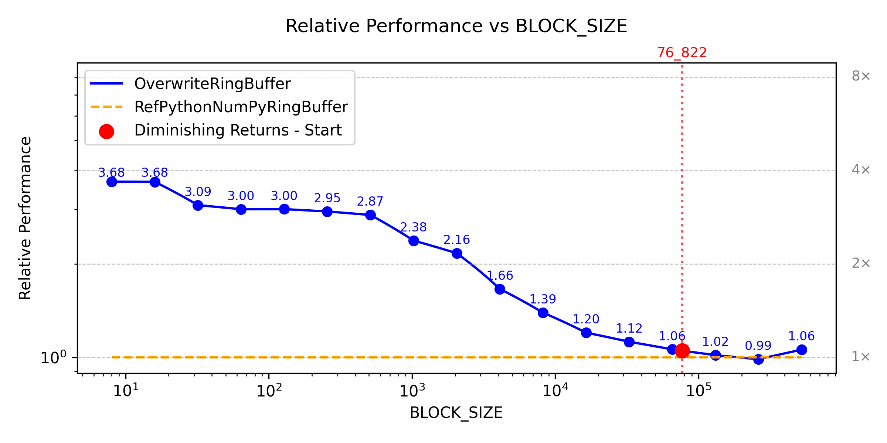

##### float32

###### block size

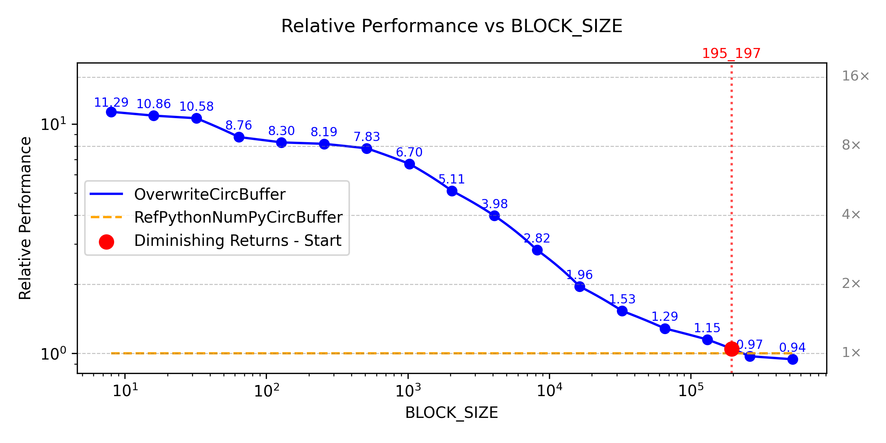

### Operation Focus ("calculation" vs "extend/append")

**Source File:** [bench_op_f.py](../perf/relative_benchmarks/bench_op_f.py)

**Explored parameter space:**

```text
    BLOCK_SIZE = (
        8,
        16,
        32,
        64,
        128,
        256,
        512,
        1_024,
        2_048,
        4_096,
        8_192,
        16_384,
        32_768,
        65_536,
        131_072,
        262_144,
        524_288,
    )
    MAXLEN = (
        512,
        1_024,
        2_048,
        4_096,
        8_192,
        16_384,
        32_768,
        65_536,
        131_072,
        262_144,
        524_288,
        1_048_576,
        2_097_152,
        4_194_304,
        8_388_608,
    )
    CALC_EVERY = (1, 2, 3, 4, 6, 8, 12, 16, 24, 32, 48, 64)
```

#### RunningMeanSqBuffer

**System B:**

##### float64

###### block size

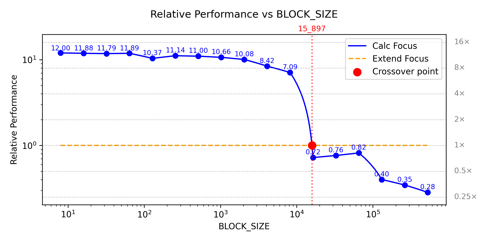

###### maxlen

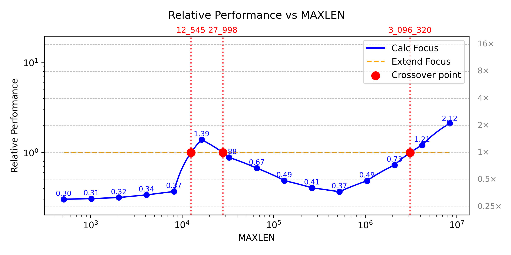

###### calc every

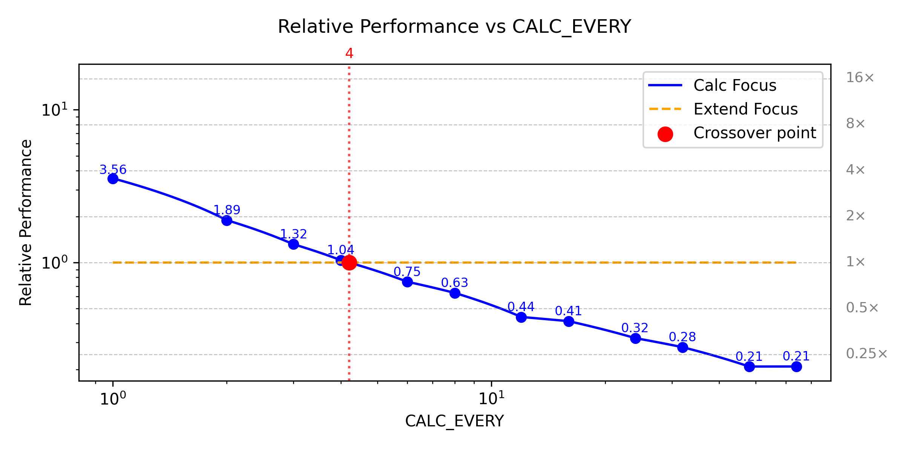

##### float32

###### block size

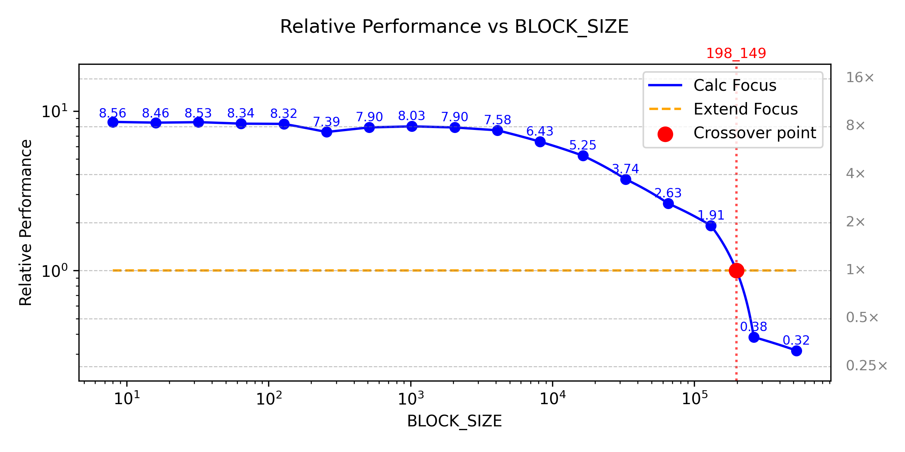

###### maxlen

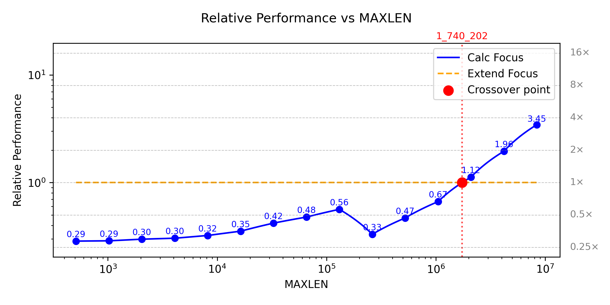

###### calc every

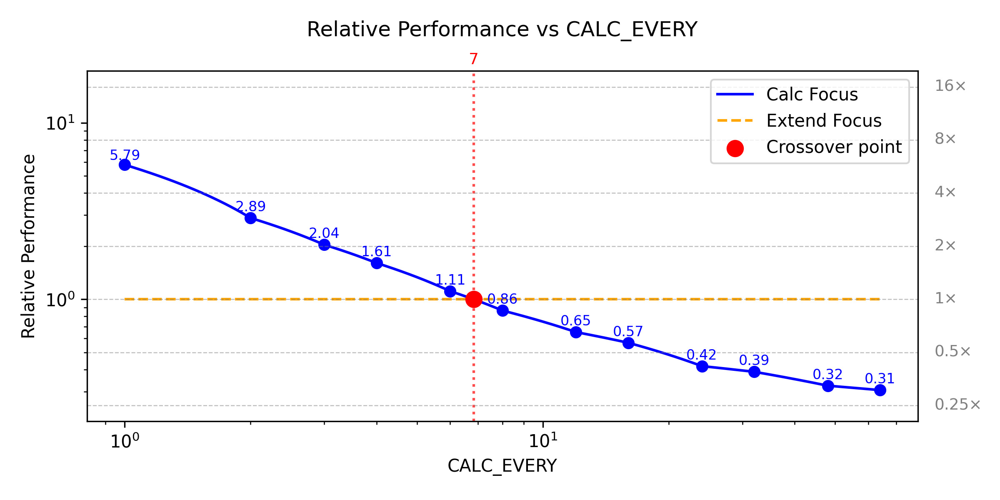

#### RunningMeanBuffer

**System B:**

##### float64

###### block size

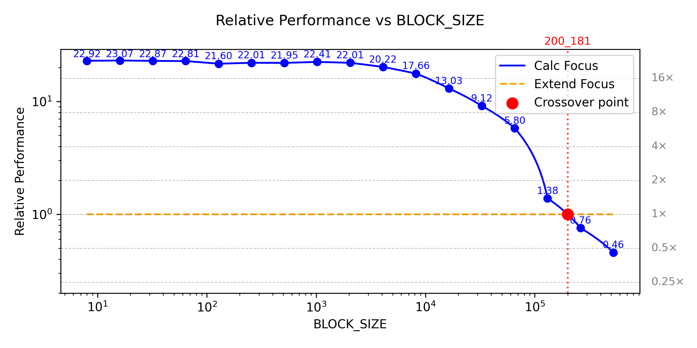

###### maxlen

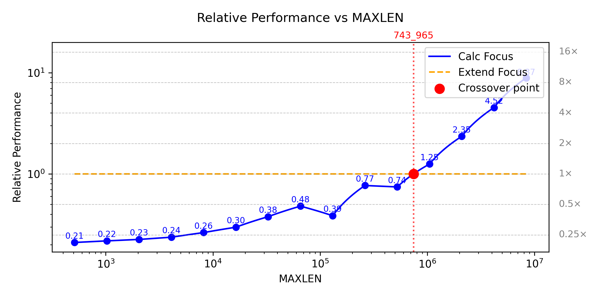

###### calc every

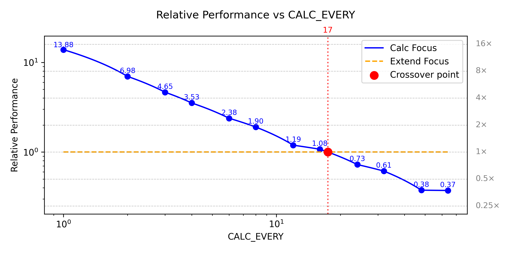

##### float32

###### block size

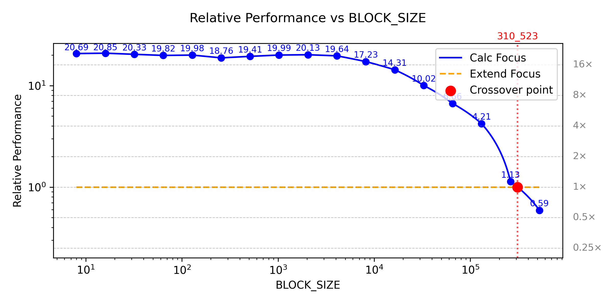

###### maxlen

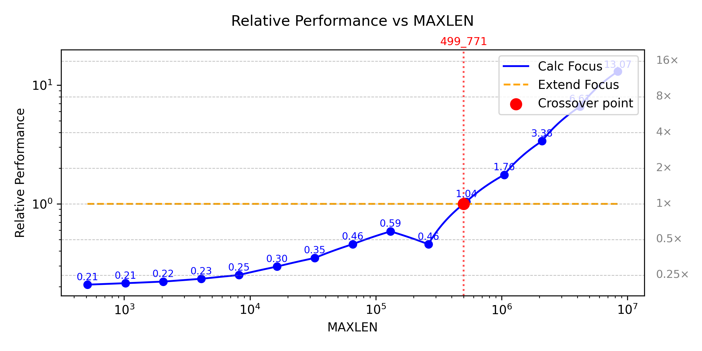

###### calc every

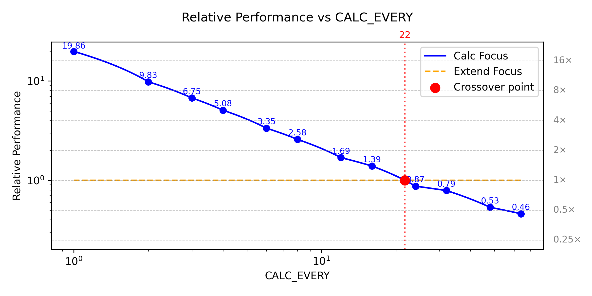

## Optimization Guide

### Optimal Buffer Selection

| Application Requirement       | Recommended Buffer      | Technical Justification                                                                                                                            |
| :---------------------------- | :---------------------- | :------------------------------------------------------------------------------------------------------------------------------------------------- |
| **High-Throughput Ingestion** | `OverwriteCircBuffer`   | Minimum-overhead implementation using raw pointer arithmetic; optimized for single-threaded write-heavy workloads.                                 |
| **Producer-Consumer Sync**    | `BlockingCircBuffer`    | Implements thread-safe synchronization primitives and strict FIFO ordering for multi-threaded environments without manual locking/ticketing logic. |
| **Windowed Statistics**       | `RunningMeanBuffer`     | Maintains an internal $\sum x$ accumulator to provide **$O(1)$ mean** calculation, decoupling latency from window size.                            |
| **Power/Energy Analysis**     | `RunningMeanSqBuffer`   | Maintains an internal $\sum x^2$ accumulator for **$O(1)$ mean-square** updates, ideal for real-time RMS calculations.                             |
| **Non-Linear Analytics**      | `IntegratedGatedBuffer` | Specialized implementation for gated accumulation in integrated loudness pipelines.                                                                |

### Performance Tips

1. **Use `extend()` for bulk operations:** Bulk operations minimize the frequency of Python-to-C context switching and allow the underlying engine to utilize vectorized memory copy routines.
2. **Choose operation focus at runtime:** For `RunningMeanBuffer`/`RunningMeanSqBuffer`, choose operation focus using `determine_operation_focus` helper provided. This allows the internal logic to optimize for the required use-case on available hardware.
3. **Precision and Cache Efficiency:** Use `np.float32` where full 64-bit precision is not mathematically required. Reducing the word size from 8 to 4 bytes effectively doubles the number of elements that can fit within the CPU caches and halves the required memory bus bandwidth.
4. **Extend with NumPy Arrays of the same dtype**: The library supports conversion but the extends will be substantially slower as it triggers implicit type-casting and temporary array creation, which incurs a significant CPU and memory allocation penalty.

### Thread Safety Considerations

- **Atomic Constraints:** Standard buffer variants are not thread-safe and omit internal locking mechanisms to maximize single-threaded throughput. If multi-threaded access is required for these variants, external synchronization (e.g., `threading.Lock`) must be managed by the caller.
- **Concurrency Scalability:** Increasing the thread count does not provide linear throughput scaling for thread-safe variants. High contention for the internal lock can degrade performance due to increased kernel-level context switching and synchronization overhead.
- **Timeouts:** When utilizing `BlockingCircBuffer`, implement appropriate timeout strategies to prevent indefinite pipeline stalls. Unbounded blocking can lead to global deadlocks if a thread in the producer/consumer chain fails to release its dependency.
- **Thread Integrity and Liveness:** To ensure strict FIFO ordering and deterministic execution, `BlockingCircBuffer` requires standard thread lifecycle management. Abrupt thread termination (e.g., via SIGKILL or hard cancellation) while a thread is performing or waiting on operations (read/write) will result in a permanent deadlock state. This design prioritizes high-performance state transitions and data integrity over the inherent unreliability of system-level thread monitoring.

### Best Practices

#### Code Examples

```python
# Good: Use extend for bulk operations

buffer = OverwriteCircBuffer(10000)

# Data in bulk
data = np.random.rand(10000)

# Efficient: Use extend
buffer.extend(data)

# Bad: Use individual appends in loop
for value in data:
    buffer.append(value)  # Much slower
```

```python
# Memory-efficient usage patterns

# Good: Reuse buffers
buffer = OverwriteCircBuffer(10000)
for epoch in range(100):
    buffer.clear()  # Reset without reallocating
    # Process data...

# Bad: Create new buffers frequently
for epoch in range(100):
    buffer = OverwriteCircBuffer(10000)  # New allocation each time
    # Process data...
```

## Conclusion

Standard Python containers (e.g. `collections.deque`, `list`) are designed for general-purpose use with an emphasis on versatility; they don't perform as desired under the demands of high-throughput numerical workloads. The data above confirms that NumCircBuf effectively solves this problem.

### Technical Summary

- **Hardware-Adaptive SIMD:** Vectorized mathematical computations leverage NumPy’s runtime dispatch. Delegating execution dynamically selects the most efficient SIMD kernels (AVX-512, AVX2, NEON, etc.) depending on the host CPU. In addition, raw memory movement benefit from architecture-specific vectorized code paths using `memcpy` routines provided by the system C runtime. This architecture provides a performance advantage over static Cython/C implementations.
- **Memory & Workspace:** Primary storage uses pre-allocated contiguous memory which prevents heap fragmentation. Some math operations, require temporary copies; this trade-off allows the library to maximize computational throughput.
- **Algorithmic Complexity:** Rolling statistical metrics (mean, mean-square) are implemented via **O(1) recurrence relations**. Computational cost of windowed analytics is decoupled from the buffer size by maintaining internal accumulators, ensuring fixed-time execution even with extremely large window depths.
- **Numerical Integrity:** Precision is enforced through type-specific execution paths. FP32 buffers perform explicit single-precision arithmetic to ensure bit-level determinism. A specialized handling policy for **IEEE 754 non-finite values (inf, nan)** is implemented, that prioritizes data transparency over silent error correction. Though the implementation performs a single-pass resynchronization of the accumulator to correct for numerical drift, it does not engage in persistent suppression of non-finite values. This ensures that if the input stream is corrupted, the internal state faithfully reflects that corruption rather than masking it through silent removal.

### Performance Comparison

Compared to standard Python containers, NumCircBuf offers a noticeable performance increase by saturating single-threaded hardware bandwidth:

- **vs. `collections.deque` & Python lists**: **500–1500× faster** for bulk `extend`, and **1.5–3× faster** for single `append`.
- **vs. Optimized NumPy Ring Buffers**: **Up to 10× faster**.

### When to Use NumCircBuf

**Ideal for:**

- High-frequency data ingestion (e.g., telemetry, sensors).
- Real-time digital signal processing (DSP).
- Latency-sensitive workloads requiring O(1) statistical updates.

**Consider alternatives for:**

- Applications requiring dynamic resizing of buffers.
- Storage of non-numeric or heterogeneous Python objects.
- Simple use cases where the buffers are not a bottleneck.

> Performance figures were obtained on representative workloads using the benchmark code above.
> Results can vary depending on hardware, data layout, and workload characteristics.

## Running Benchmarks

You can benchmark NumCircBuf for your specific use case using utilities from the `numcircbuf.bench_utils` sub-module.
Benchmark examples discussed in this document are also included in the GitHub repository for quick testing and comparision.

## Additional Resources

- **Project Overview**: [README.md](../README.md) — Installation, usage, and examples.
- **Versioning Policy**: [VERSIONING.md](VERSIONING.md) — Stability policy and migration strategy.
- **Change History**: [CHANGELOG.md](CHANGELOG.md) — Detailed list of changes per version.
- **Support**: [Support Policy](../README.md#support) — How to get help and report issues.
