# Performance Analysis and Benchmarks

NumCircBuf is a high-performance Python library providing numerical circular buffers, featuring O(1) accumulators and specialized calculation variants. This document details empirical benchmarks across varied hardware architectures, explains core design trade-offs, and provides practical guidance for optimizing workloads.

## Table of Contents

- [Performance Characteristics](#performance-characteristics)
- [Architecture & Design Principles](#architecture--design-principles)
- [Core Benchmarking Methodology](#core-benchmarking-methodology)
- [Baselines & Reference Implementations](#baselines--reference-implementations)
- [Benchmarking Systems](#benchmarking-systems)
- [Raw Benchmarks](#raw-benchmarks)
- [Relative Benchmarks](#relative-benchmarks)
- [Benchmark Conclusion](#benchmark-conclusion)
- [Running Benchmarks](#running-benchmarks)
- [Optimization Guide](#optimization-guide)
- [Additional Resources](#additional-resources)

## Performance Characteristics

### Time Complexity

#### Common Operations (All Buffer Categories)

| Operation Category | Complexity               |
| ------------------ | ------------------------ |
| extend             | $O(n)$                   |
| append             | $O(1)$                   |
| `view()`           | $O(1)$ view, $O(n)$ copy |
| `clear()`          | $O(1)$                   |
| clear NaN or Infs  | $O(n)$                   |

#### Buffer-Specific Operations

| Operation Category | OverwriteCircBuffer | BlockingCircBuffer | Utility Buffers                    |
| ------------------ | ------------------- | ------------------ | ---------------------------------- |
| statistics         | $O(n)$              | N/A                | $O(n)$ / $O(1)$ for some buffers\* |

\* RunningMeanBuffer / RunningMeanSqBuffer may be $O(1)$ or $O(n)$ depending on operation focus; IntegratedGatedBuffer is always $O(n)$ due to relative gating

### Space Complexity

- **Primary Storage**: $O(N)$ where $N$ is the buffer capacity.
- **Transient Workspace**: Certain mathematical operations require temporary $O(K)$ workspace (where $K \leq N$) for higher computational throughput. These allocations exist only for the duration of the specific operation.

## Architecture & Design Principles

- **Hardware-Adaptive SIMD:** Vectorized mathematical computations leverage NumPy’s runtime dispatch. Delegating execution dynamically selects the most efficient SIMD kernels (AVX-512, AVX2, NEON, etc.) depending on the host CPU. In addition, raw memory movement benefit from architecture-specific vectorized code paths using `memcpy` routines provided by the system C runtime. This architecture provides a performance advantage over static Cython/C implementations.
- **Memory & Workspace:** Primary storage uses pre-allocated contiguous memory which prevents heap fragmentation. Some math operations, require temporary copies; this trade-off allows the library to maximize computational throughput.
- **Configurable Algorithmic Focus:** Running statistical buffers (`RunningMeanBuffer`, `RunningMeanSqBuffer`) allow callers to tune the write-vs-query trade-off via `operation_focus`. In `"calculation"` mode, metrics are maintained via $O(1)$ recurrence relations using internal accumulators, decoupling calculation latency from window depth. In `"extend/append"` mode, accumulator tracking is deferred to minimize per-write overhead, computing statistics lazily on demand.
- **Numerical Integrity:** Precision is enforced through type-specific execution paths. FP32 buffers perform explicit single-precision arithmetic to ensure bit-level determinism. A specialized handling policy for **IEEE 754 non-finite values (inf, nan)** is implemented, that prioritizes data transparency over silent error correction. Though the implementation performs a single-pass resynchronization of the accumulator to correct for numerical drift, it does not engage in persistent suppression of non-finite values. This ensures that if the input stream is corrupted, the internal state faithfully reflects that corruption rather than masking it through silent removal.

## Core Benchmarking Methodology

### Main Buffers

#### OverwriteCircBuffer

1. Times are measured in nanoseconds using Python’s arbitrary-precision integers for maximum precision.
2. Each test uses a block, whose size never exceeds the buffer's maxlen.
3. We benchmark a single block-extend operation per timing using `extend_unchecked`.
4. At the start of the benchmark, CPU cache is thrashed, and a single warm-up block is extended to the buffer to ensure the buffer’s internal memory is mapped.
5. There are multiple runs; for each run we use a separate block.
6. Before each run:
   - The buffer is cleared.
   - For the current block, one element per memory page is touched (`page_size // element_size` stride) to fault the block into RAM while introducing only negligible CPU cache warming (one cache line per page).
7. Runs are split into two groups:
   - **Wrap Runs:** extend the buffer with a unique offset block of size `buffer_maxlen - (block_size // 2)`, so half the block wraps around and half does not. Record the timing in `wrap_times`.
   - **No-Wrap Runs:** perform the single block-extend (no wrap) and record the timing in `nowrap_times`.
8. For each list (`wrap_times`, `nowrap_times`) discard the first 10% of measurements (warmup) and compute the mean of the remaining values. The final benchmark time is the average of those two means.

#### BlockingCircBuffer

Follows the `OverwriteCircBuffer` protocol (using `write_extend_unchecked` for writes), but measures both write and read throughput. In each run, read throughput (benchmarking either `read` or `read_into`) is measured immediately after the extend operation completes.

### Utility Buffers

Follows the OverwriteCircBuffer method, with additional steps.

1. At the start of each run we now also fill the buffer with unique data.
2. A mask determines after how many blocks the calculation function is called.
3. On 'Calculate' runs, we measure the extend operation plus calculation function call.

## Baselines & Reference Implementations

- **RefPythonNumPyCircBuffer:** Optimized reference baseline written in Python using NumPy (`numcircbuf.bench_utils.RefPythonNumPyCircBuffer`).
- **BenchDeque:** Python's standard library `collections.deque` (wrapped in the benchmark harness).
- **BenchList:** Python's standard library `list` (wrapped in the benchmark harness).

## Benchmarking Systems

| Specification        | System A                                            | System B                                              |
| :------------------- | :-------------------------------------------------- | :---------------------------------------------------- |
| **CPU**              | **AMD Ryzen 7 7700X**                               | **AMD Ryzen 5 5600**                                  |
| Cores / Threads      | 8 / 16                                              | 6 / 12                                                |
| Frequency            | ~5.10–5.35 GHz                                      | ~4.44 GHz                                             |
| Cache (L1 / L2 / L3) | 64 KB (per core) / 1 MB (per core) / 32 MB (shared) | 64 KB (per core) / 512 KB (per core) / 32 MB (shared) |
| **RAM**              | **TeamGroup T-Force Delta RGB DDR5-6400**           | **XPG SPECTRIX D35G**                                 |
| Configuration        | 16 GB × 2 (2 Channels, UDIMM)                       | 16 GB × 2 (2 Channels, UDIMM)                         |
| Speed & Timings      | 6000 MT/s (CL 38-38-38-78)                          | 3666 MT/s (CL 18-22-22-44)                            |
| **Environment**      |                                                     |                                                       |
| Operating System     | Windows 11 Pro 25H2 (26200.8457)                    | Windows 10 Pro 22H2 (19045.6456)                      |
| Python               | 3.12.12                                             | 3.12.12                                               |
| NumPy                | 2.4.1                                               | 2.4.1                                                 |

## Raw Benchmarks

### OverwriteCircBuffer

**Source File:** [raw_overwrite_buf.py](../perf/raw_benchmarks/raw_overwrite_buf.py)

**Explored parameter space:**

- `DTYPE = np.float64`
- `MAXLEN_BYTE_LIMIT = 65_536`
- `BLOCK_BYTE_LIMIT = 65_536`

**Extend Throughput (GB/s):**

| Implementation           | System A (Cold Cache) | System A (Warm Cache) | System B (Cold Cache) | System B (Warm Cache) |
| :----------------------- | :-------------------: | :-------------------: | :-------------------: | :-------------------: |
| **OverwriteCircBuffer**  |       **35.20**       |       **72.98**       |       **32.59**       |       **50.53**       |
| RefPythonNumPyCircBuffer |         19.00         |         26.36         |         14.81         |         17.35         |
| BenchDeque               |        0.06238        |        0.06234        |        0.03340        |        0.03280        |
| BenchList                |        0.06327        |        0.06296        |        0.03396        |        0.03329        |

**Append Throughput (GB/s):**

| Implementation           | System A (Cold Cache) | System A (Warm Cache) | System B (Cold Cache) | System B (Warm Cache) |
| :----------------------- | :-------------------: | :-------------------: | :-------------------: | :-------------------: |
| **OverwriteCircBuffer**  |      **0.14550**      |      **0.14550**      |      **0.08791**      |      **0.08889**      |
| RefPythonNumPyCircBuffer |        0.04420        |        0.04494        |        0.02524        |        0.02564        |
| BenchDeque               |        0.09412        |        0.09195        |        0.05594        |        0.05674        |
| BenchList                |        0.05970        |        0.05970        |        0.03162        |        0.03226        |

---

### BlockingCircBuffer

**Source File:** [raw_blocking_buf.py](../perf/raw_benchmarks/raw_blocking_buf.py)

**Explored parameter space:**

- `DTYPE = np.float64`
- `MAXLEN_BYTE_LIMIT = 65_536`
- `BLOCK_BYTE_LIMIT = 65_536`

**Throughput Comparison (GB/s):**

| Warm Cache | Read Into Array | System A Write | System A Read | System B Write | System B Read |
| :--------: | :-------------: | :------------: | :-----------: | :------------: | :-----------: |
| **False**  |    **False**    |     25.78      |     40.40     |     22.11      |     23.81     |
| **False**  |    **True**     |     24.99      |     44.16     |     22.33      |     29.71     |
|  **True**  |    **False**    |     44.28      |     40.66     |     29.40      |     23.15     |
|  **True**  |    **True**     |     45.86      |     44.31     |     30.10      |     29.36     |

---

### Utility/Calculation Buffers

**Source File:** [raw_util_buffers.py](../perf/raw_benchmarks/raw_util_buffers.py)

**Explored parameter space:**

- `CALC_EVERY = 1`
- `MAXLENS = (4096, 8192, 16_384, 32_768, 65_536)`
- `BLOCK_SIZES = (4096, 8192, 16_384, 32_768, 65_536)`

#### RunningMeanSqBuffer

_Metrics measure combined ingestion and statistical calculation (`extend_unchecked` + `mean_square`)._

| Dtype       | Warm Cache | System A (M elem/s) | System A (GB/s) | System B (M elem/s) | System B (GB/s) |
| :---------- | :--------: | :-----------------: | :-------------: | :-----------------: | :-------------: |
| **float32** |   False    |     ~1248–7107      |   4.992–28.43   |      ~800–5384      |   3.199–21.54   |
| **float32** |    True    |     ~1405–10089     |   5.619–40.35   |      ~842–5901      |   3.367–23.60   |
| **float64** |   False    |      ~296–2588      |   2.372–20.71   |      ~148–1869      |   1.185–14.95   |
| **float64** |    True    |      ~292–3633      |   2.333–29.06   |      ~147–2229      |   1.177–17.83   |

#### RunningMeanBuffer

_Metrics measure combined ingestion and statistical calculation (`extend_unchecked` + `mean`)._

| Dtype       | Warm Cache | System A (M elem/s) | System A (GB/s) | System B (M elem/s) | System B (GB/s) |
| :---------- | :--------: | :-----------------: | :-------------: | :-----------------: | :-------------: |
| **float32** |   False    |      ~571–3743      |   2.284–14.97   |      ~331–2656      |   1.323–10.62   |
| **float32** |    True    |      ~611–4749      |   2.442–19.00   |      ~343–2810      |   1.371–11.24   |
| **float64** |   False    |      ~490–2515      |   3.923–20.12   |      ~295–1898      |   2.358–15.18   |
| **float64** |    True    |      ~528–3328      |   4.228–26.63   |      ~313–2147      |   2.507–17.17   |

#### IntegratedGatedBuffer

_Metrics measure combined ingestion and statistical calculation (`extend_unchecked` + `gated_mean_square`)._

| Dtype       | Warm Cache | System A (M elem/s) | System A (GB/s) | System B (M elem/s) | System B (GB/s) |
| :---------- | :--------: | :-----------------: | :-------------: | :-----------------: | :-------------: |
| **float32** |   False    |       ~46–711       |  0.1841–2.844   |       ~34–534       |  0.1349–2.137   |
| **float32** |    True    |       ~48–732       |  0.1916–2.927   |       ~36–543       |  0.1431–2.171   |
| **float64** |   False    |       ~28–382       |  0.2251–3.058   |       ~17–256       |  0.1369–2.050   |
| **float64** |    True    |       ~29–401       |  0.2289–3.206   |       ~19–264       |  0.1524–2.115   |

---

## Relative Benchmarks

### OverwriteCircBuffer vs RefPythonNumPyCircBuffer

**Source File:** [bench_raw_buf.py](../perf/relative_benchmarks/bench_raw_buf.py)

**Explored parameter space:**

```text
BLOCK_SIZE = MAXLEN = (
    8, 16, 32, 64, 128, 256, 512, 1_024, 2_048,
    4_096, 8_192, 16_384, 32_768, 65_536, 131_072, 262_144, 524_288
)
```

#### System B

##### float64: block size

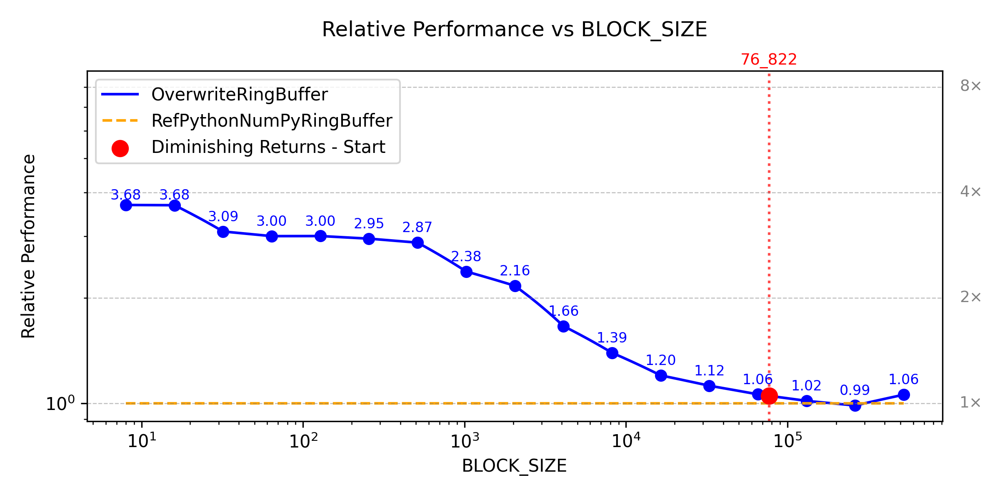

##### float32: block size

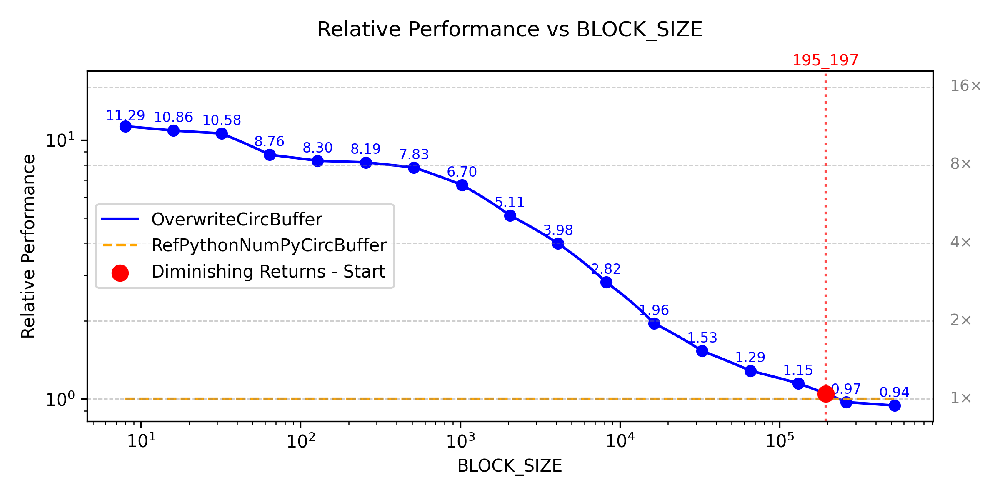

### Operation Focus ("calculation" vs "extend/append")

**Source File:** [bench_op_f.py](../perf/relative_benchmarks/bench_op_f.py)

**Explored parameter space:**

```text
BLOCK_SIZE = (
    8, 16, 32, 64, 128, 256, 512, 1_024, 2_048,
    4_096, 8_192, 16_384, 32_768, 65_536, 131_072, 262_144, 524_288,
)
MAXLEN = (
    512, 1_024, 2_048, 4_096, 8_192, 16_384, 32_768, 65_536,
    131_072, 262_144, 524_288, 1_048_576, 2_097_152, 4_194_304, 8_388_608,
)
CALC_EVERY = (1, 2, 3, 4, 6, 8, 12, 16, 24, 32, 48, 64)
```

#### RunningMeanSqBuffer

**System B:**

##### float64: block size

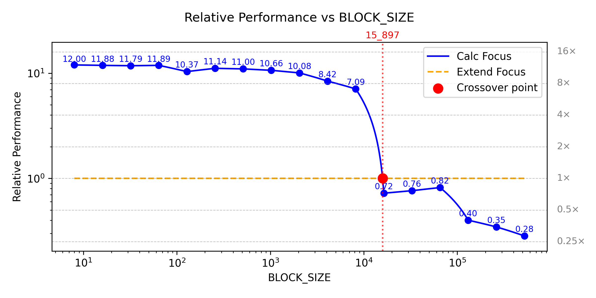

##### float64: maxlen

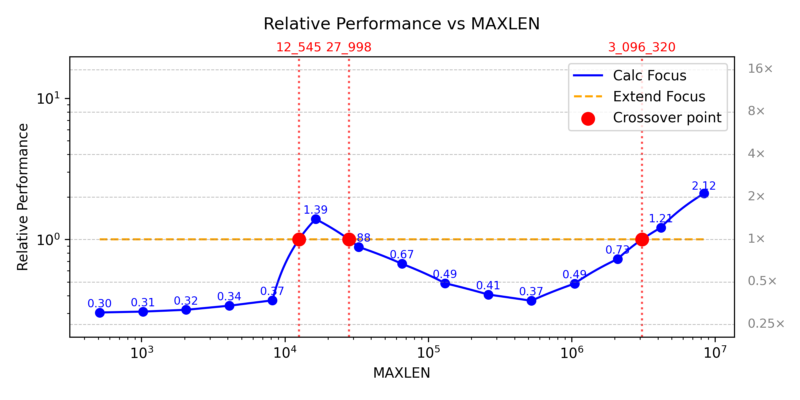

##### float64: calc every

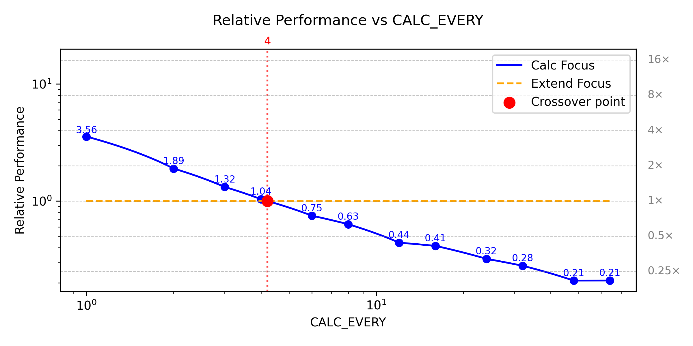

##### float32: block size

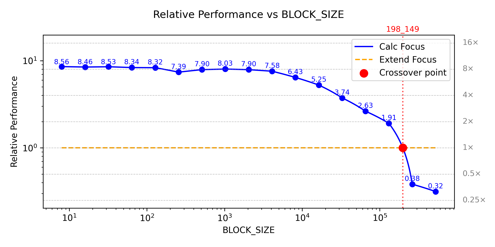

##### float32: maxlen

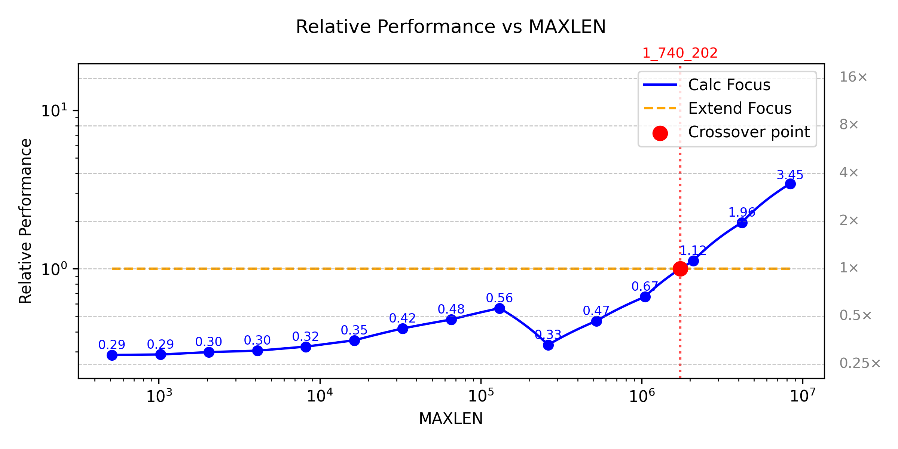

##### float32: calc every

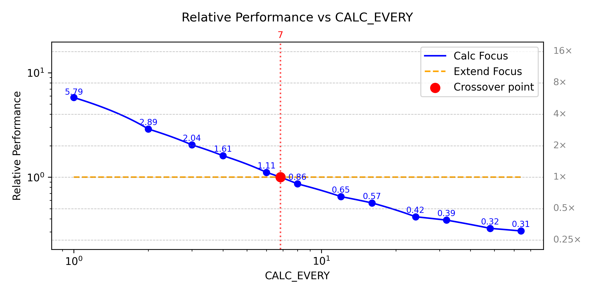

#### RunningMeanBuffer

**System B:**

##### float64: block size

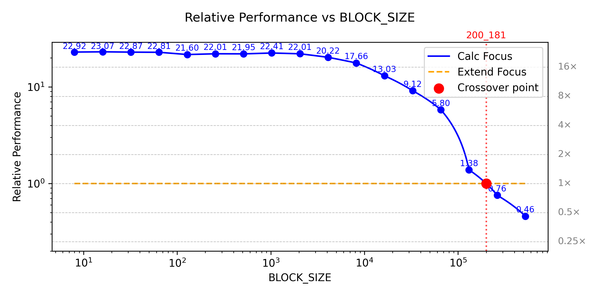

##### float64: maxlen

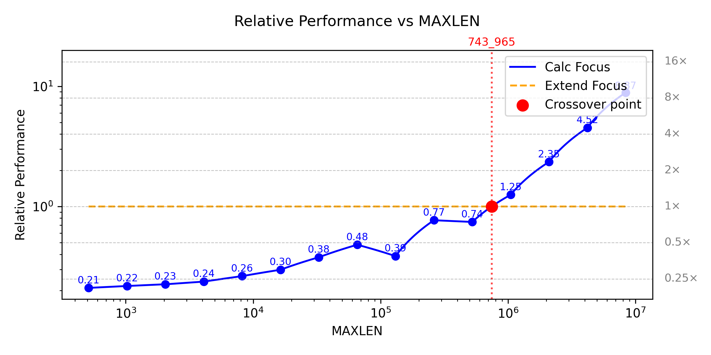

##### float64: calc every

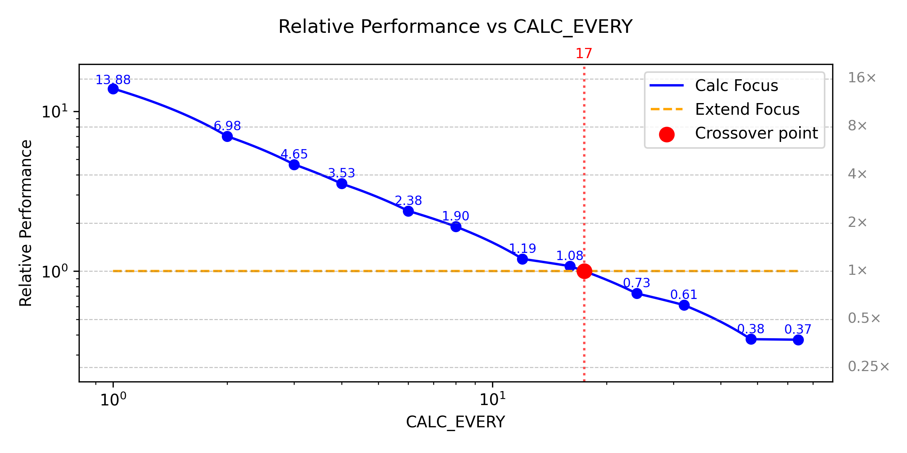

##### float32: block size

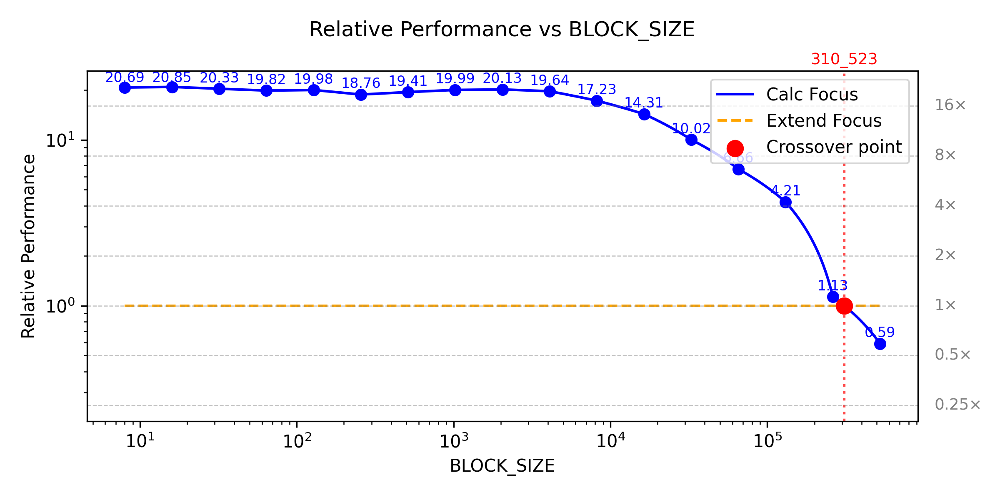

##### float32: maxlen

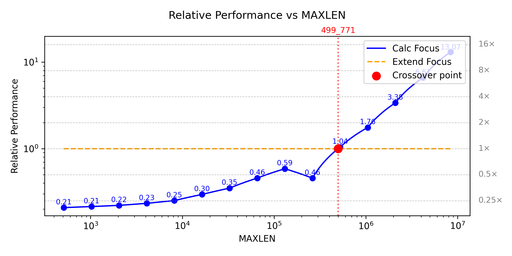

##### float32: calc every

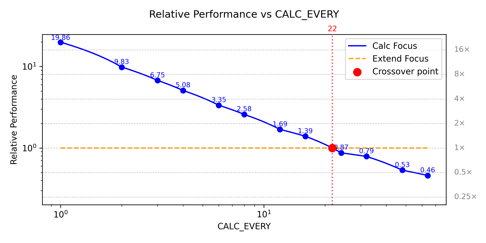

## Benchmark Conclusion

Standard Python containers (e.g. `collections.deque`, `list`) are designed for general-purpose use with an emphasis on versatility; they don't perform as desired under the demands of high-throughput numerical workloads. The data above confirms that NumCircBuf effectively solves this problem.

### Performance Comparison

Compared to standard Python containers, NumCircBuf offers a noticeable performance increase by saturating single-threaded hardware bandwidth:

- **vs. `collections.deque` & Python lists**: **500–1500× faster** for bulk `extend`, and **1.5–3× faster** for single `append`.
- **vs. Optimized NumPy Ring Buffers**: **Up to 10× faster**.

> Performance figures were obtained on representative workloads using the benchmark code above.
> Results can vary depending on hardware, data layout, and workload characteristics.

## Running Benchmarks

You can benchmark NumCircBuf for your specific use case using utilities from the `numcircbuf.bench_utils` sub-module.
Benchmark examples discussed in this document are also included in the GitHub repository for quick testing and comparision.

## Optimization Guide

### When to Use NumCircBuf

**Ideal for:**

- High-frequency data ingestion (e.g., telemetry, sensors).
- Real-time digital signal processing (DSP).
- Latency-sensitive workloads requiring O(1) statistical updates.

**Consider alternatives for:**

- Applications requiring dynamic resizing of buffers.
- Storage of non-numeric or heterogeneous Python objects.
- Simple use cases where the buffers are not a bottleneck.

### Optimal Buffer Selection

| Application Requirement       | Recommended Buffer      | Technical Justification                                                                                                                              |
| :---------------------------- | :---------------------- | :--------------------------------------------------------------------------------------------------------------------------------------------------- |
| **High-Throughput Ingestion** | `OverwriteCircBuffer`   | Minimum-overhead implementation using raw pointer arithmetic; optimized for single-threaded write-heavy workloads.                                   |
| **Producer-Consumer Sync**    | `BlockingCircBuffer`    | Implements thread-safe synchronization primitives and strict FIFO ordering for multi-threaded environments without manual locking/ticketing logic.   |
| **Windowed Statistics**       | `RunningMeanBuffer`     | Configurable dual-mode buffer; supports **$O(1)$ mean** calculations via internal $\sum x$ accumulators, decoupling query latency from window depth. |
| **Power/Energy Analysis**     | `RunningMeanSqBuffer`   | Configurable dual-mode buffer; supports **$O(1)$ mean-square** updates via internal $\sum x^2$ accumulators, ideal for real-time RMS calculations.   |
| **Non-Linear Analytics**      | `IntegratedGatedBuffer` | Specialized implementation for gated accumulation in integrated loudness pipelines.                                                                  |

### Performance Tips

1. **Use `extend()` for bulk operations:** Bulk operations minimize the frequency of Python-to-C context switching and allow the underlying engine to utilize vectorized routines.
2. **Tune `operation_focus` empirically:** For `RunningMeanBuffer` and `RunningMeanSqBuffer`, the break-even point between `"calculation"` and `"extend/append"` depends on the host hardware and how frequently you query statistics (`calc_every`). Unless your pipeline strictly requires guaranteed $O(1)$ query latency (which calls for `"calculation"`), consider using the library utility `determine_operation_focus` to automatically benchmark and identify the highest-throughput strategy for the target hardware.
3. **Precision and Cache Efficiency:** Use `np.float32` where full 64-bit precision is not mathematically required. Reducing the word size from 8 to 4 bytes effectively doubles the number of elements that can fit within the CPU caches and halves the required memory bus bandwidth.
4. **Extend with NumPy Arrays of the same dtype**: The library supports conversion but the extends will be substantially slower as it triggers implicit type-casting and temporary array creation, which incurs a significant CPU and memory allocation penalty.

### Thread Safety Considerations

- **Atomic Constraints:** Standard buffer variants are not thread-safe and omit internal locking mechanisms to maximize single-threaded throughput. If multi-threaded access is required for these variants, external synchronization (e.g., `threading.Lock`) must be managed by the caller.
- **Concurrency Scalability:** Increasing the thread count does not provide linear throughput scaling for thread-safe variants. High contention for the internal lock can degrade performance due to increased kernel-level context switching and synchronization overhead.
- **Timeouts:** When utilizing `BlockingCircBuffer`, implement appropriate timeout strategies to prevent indefinite pipeline stalls. Unbounded blocking can lead to global deadlocks if a thread in the producer/consumer chain fails to release its dependency.
- **Thread Integrity and Liveness:** To ensure strict FIFO ordering and deterministic execution, `BlockingCircBuffer` requires standard thread lifecycle management. Abrupt thread termination (e.g., via SIGKILL or hard cancellation) while a thread is performing or waiting on operations (read/write) will result in a permanent deadlock state. This design prioritizes high-performance state transitions and data integrity over the inherent unreliability of system-level thread monitoring.

### Best Practice Patterns

```python
# Good: Use extend for bulk operations

buffer = OverwriteCircBuffer(10000)

# Data in bulk
data = np.random.rand(10000)

# Efficient: Use extend
buffer.extend(data)

# Bad: Use individual appends in loop
for value in data:
    buffer.append(value)  # Much slower
```

```python
# Memory-efficient usage patterns

# Good: Reuse buffers
buffer = OverwriteCircBuffer(10000)
for epoch in range(100):
    buffer.clear()  # Reset without reallocating
    # Process data...

# Bad: Create new buffers frequently
for epoch in range(100):
    buffer = OverwriteCircBuffer(10000)  # New allocation each time
    # Process data...
```

## Additional Resources

- **Project Overview**: [README.md](../README.md) — Installation, usage, and examples.
- **Versioning Policy**: [VERSIONING.md](VERSIONING.md) — Stability policy and migration strategy.
- **Change History**: [CHANGELOG.md](CHANGELOG.md) — Detailed list of changes per version.
- **Support**: [Support Policy](../README.md#support) — How to get help and report issues.
